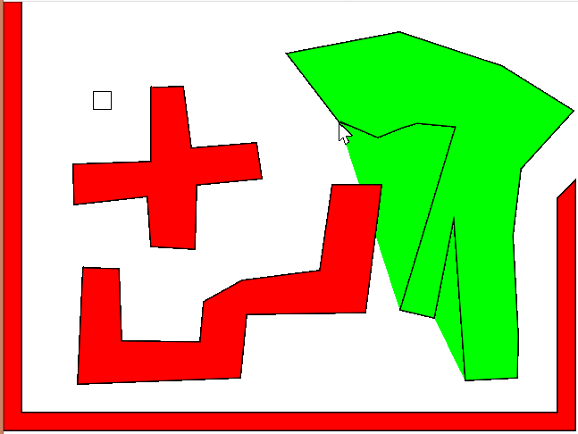

# p5_basicGameMaker

Draws your own walls and design a game using p5 and this game maker.

### How to use
- `f` turns drawing on
- `q` turns drawing off, completing the shape, and making it a real wall.
- refresh to restart everything. gets rid of all but default wall.
- edit the code to change the default wall.
- use `runAllTests(true)` in the console log to run all the tests including the verbose ones.
- use `runAllTests()` to run only the non-verbose tests

### How to run
Download p5 from https://p5js.org/, then in that directory, move or clone this repo into the same folder as the `empty-example` folder is in. Then open [index.html](./index.html)

## TODO
- [ ] Add physics environment settings such as gravity, grip, speed, jump height, rotate on collision like a rigid body...
- [ ] Add an intro menu
- [ ] Add save/load custom walls/map tool